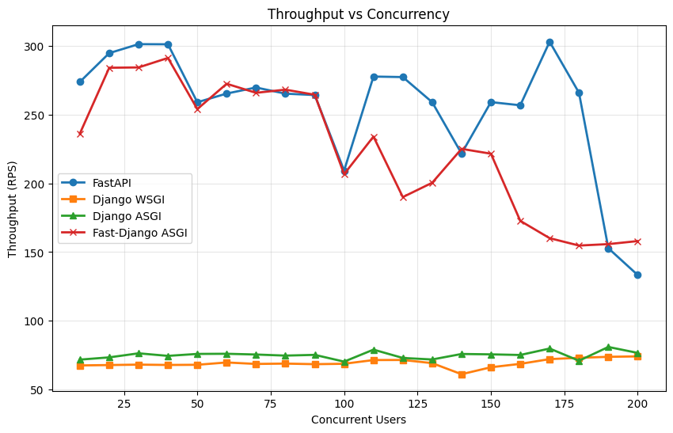
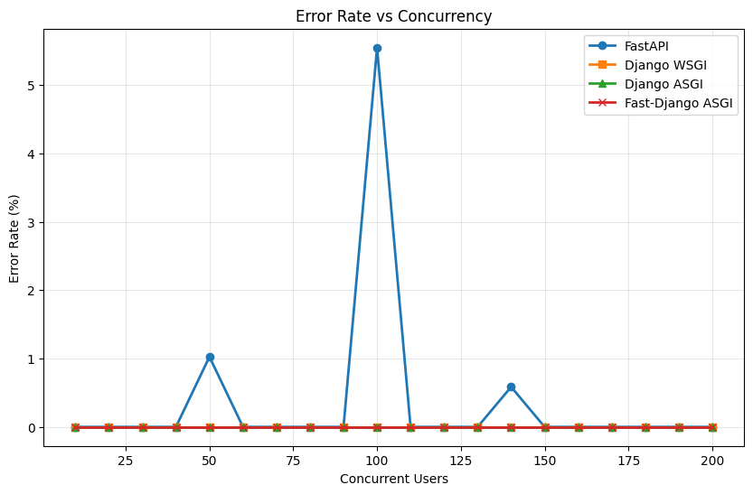
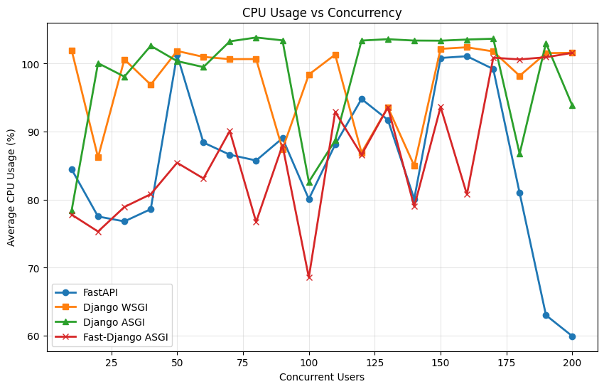
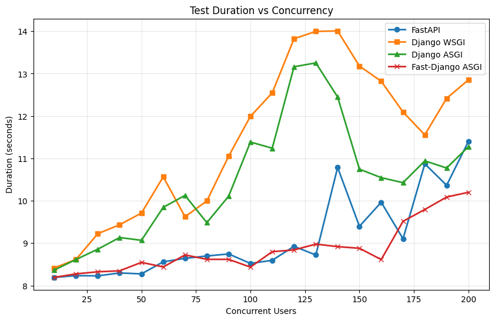
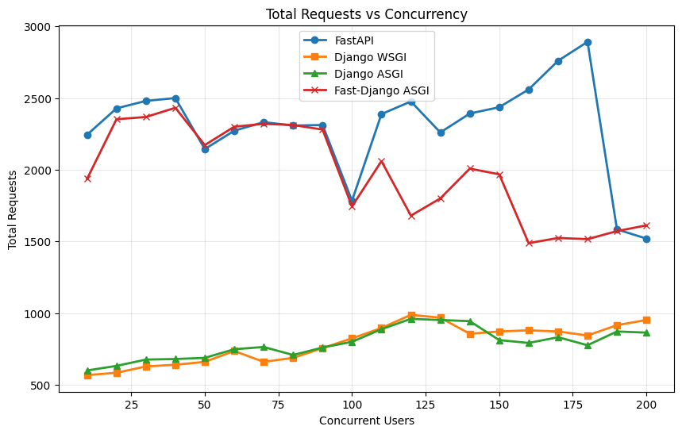

# FastAPI vs Django WSGI vs Django ASGI Performance Benchmark (Reproducible)

This repository compares an async FastAPI stack, a sync Django WSGI stack, and an async Django ASGI stack under the same I/O‑intensive workload with equalized resources. It is designed for one‑command setup, reproducible runs, and a single consolidated report with plots.

## What This Contains
- Three apps exposing identical endpoints and doing the same work:
  - FastAPI (+ Tortoise ORM, asyncpg)
  - Django WSGI (+ Django ORM, psycopg2)
  - Django ASGI (+ Django ORM with async views, psycopg2)
- MySQL in Docker shared by all three
- Identical I/O workload per request:
  - 2× file I/O (JSON write/read to per‑request unique temp file)
  - 8× database I/O (create 10, update 5, delete 5) in a single DB transaction
  - Unique emails under high concurrency to avoid collisions
- Equalized resources: 1 vCPU, 2 GB RAM per service
- Incremental benchmark script and plot generation

## Prerequisites
- macOS/Linux (or WSL2)
- Docker and Docker Compose
- Python 3.11+ on host (for running the benchmark)

## Equal Resources and Server Settings
Configured in `docker-compose.yml` and Dockerfiles:
- CPU: 1 vCPU per service (`cpus: 1.0`)
- Memory: 2 GB per service (`mem_limit: 2g`)
- Database: MySQL 8.4 (tuned via Compose)
- FastAPI server: Uvicorn with `--workers 1`, `--loop uvloop`, `--http httptools`
- Django WSGI server: Gunicorn WSGI with `-w 1 --threads 8`
- Django ASGI server: Uvicorn with `--workers 1`

## Project Structure
```
fastapi-vs-django-benchmark/
├── fastapi_app/
├── django_app/                          # Django WSGI app
├── django_asgi_app/                     # Django ASGI app
├── benchmarks/
│   ├── simple_incremental_benchmark.py   # Incremental benchmark (50→1000)
│   └── plot_results.py                   # Generate PNG plots
├── docker/
├── docker-compose.yml
├── results/
└── start_benchmark.sh                    # One‑command run
```

## 1) One‑Command Reproducible Run
```bash
./start_benchmark.sh
```
This builds the images, starts containers, runs migrations, executes the incremental benchmark (50→1000 users) across all three frameworks, and generates plots.

Outputs:
- `results/incremental_benchmark_results.json`
- `results/incremental_benchmark_report.md`
- `results/throughput_vs_concurrency.png`
- `results/error_rate_vs_concurrency.png`
- `results/cpu_usage_vs_concurrency.png`
- `results/duration_vs_concurrency.png`
- `results/total_requests_vs_concurrency.png`

## Benchmark Results

The benchmark generates several performance visualizations:

### Throughput vs Concurrency


### Error Rate vs Concurrency


### CPU Usage vs Concurrency


### Duration vs Concurrency


### Total Requests vs Concurrency


## 2) Manual Run (Optional)
Start services:
```bash
docker compose up --build -d
```
Migrate Django WSGI:
```bash
docker compose exec django python manage.py migrate
```

Migrate Django ASGI:
```bash
docker compose exec django-asgi python manage.py migrate
```
Create venv and install deps:
```bash
python -m venv venv
source venv/bin/activate
pip install aiohttp matplotlib
```
Run the benchmark:
```bash
python benchmarks/simple_incremental_benchmark.py --fastapi-url http://localhost:18000 --django-url http://localhost:18001 --django-asgi-url http://localhost:18002 --max-concurrent 1000 --step 50 --duration 30
python benchmarks/plot_results.py results/incremental_benchmark_results.json
```

## Methodology (Fairness & Parity)
- Intentional comparison: FastAPI async (ASGI, aiofiles, async ORM) vs Django sync (WSGI + DRF, sync ORM) vs Django async (ASGI + DRF, async ORM).
- Same endpoints and same work in all three apps (CRUD + file I/O) per request to `/io-intensive`.
- Per‑request unique temp file to avoid collisions.
- DB operations wrapped in a single transaction for all frameworks.
- Unique emails using timestamp+UUID under high concurrency.
- Identical hardware constraints (1 vCPU, 2 GB) enforced via Docker Compose.

## Troubleshooting
- Django `/io-intensive` path is `/api/benchmark/io_intensive/` (underscore) for both WSGI and ASGI.
- If DB connection errors appear, consider raising MySQL `max_connections` in Compose or reducing threads.
- Tail latencies near ~300s indicate saturation and client timeouts; reduce per‑request work or scale resources.
- Django ASGI requires `aiofiles` for async file operations.

## License
MIT
